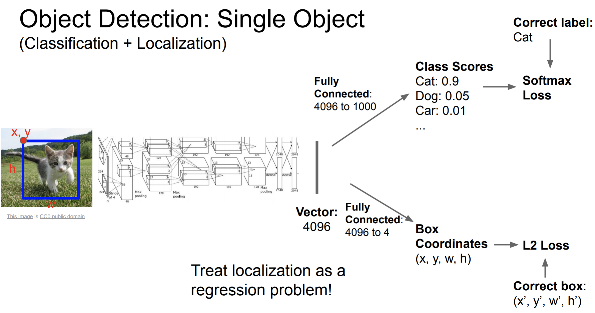
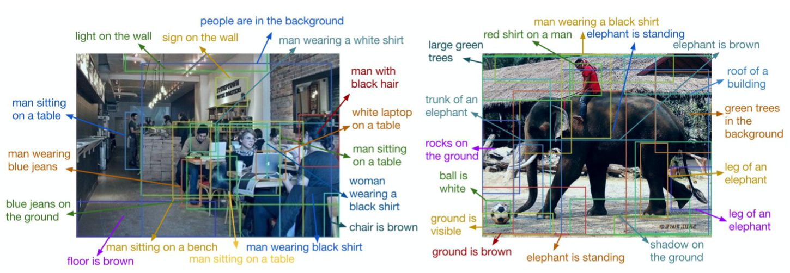
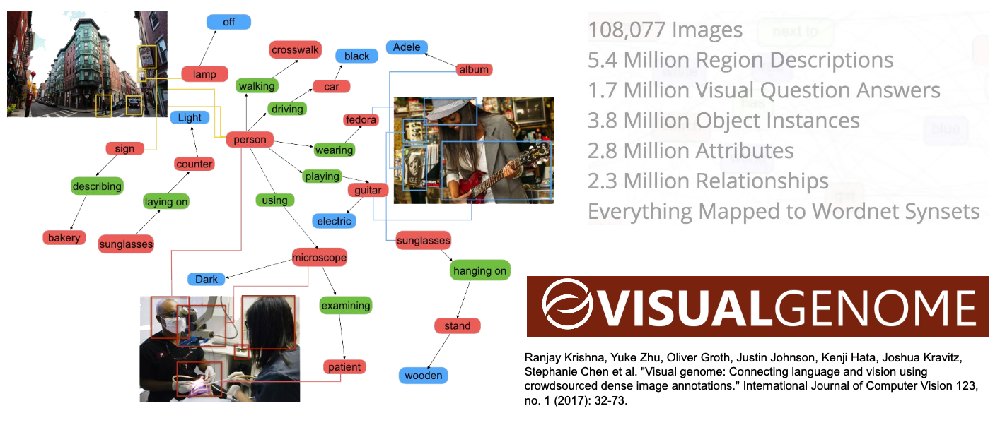
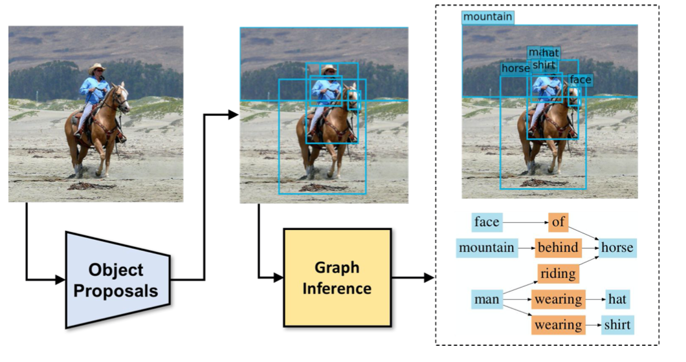
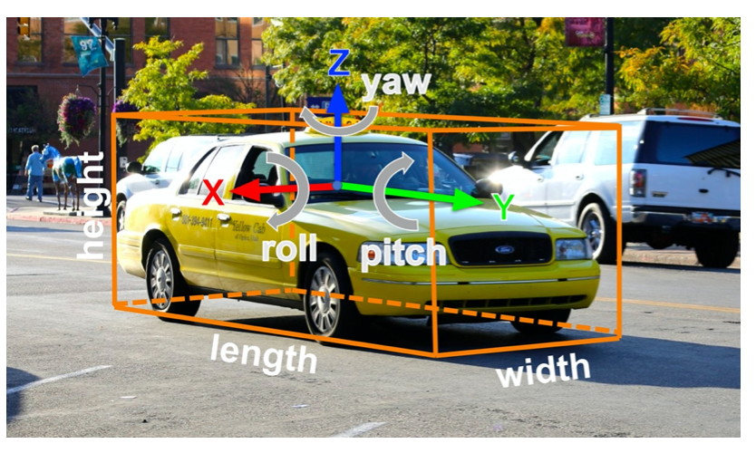
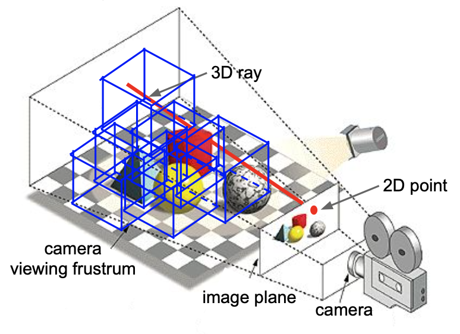
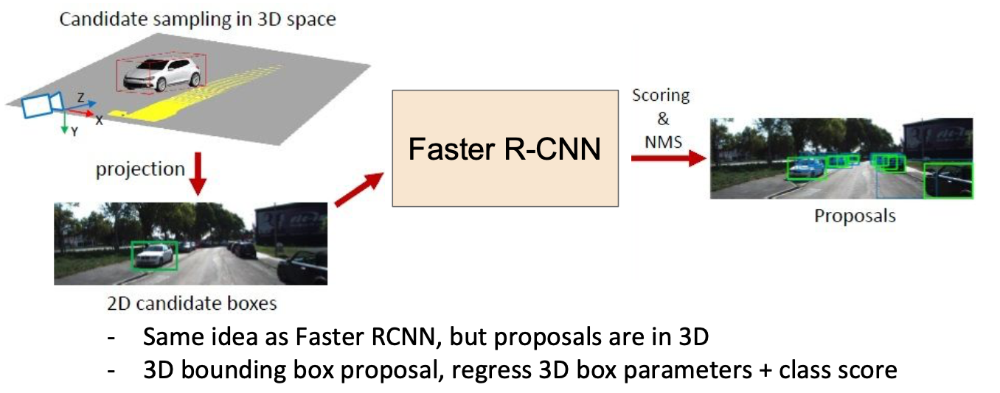

# Single Object

(Classification + Localization)

Update:

Final:

#  Multiple Objects

**Region Proposals:** Selective Search

 ● Find “blobby” image regions that are likely to contain objects 

● Relatively fast to run; e.g. Selective Search gives 2000 region proposals in a few seconds on CPU

# Beyond 2D Object Detection

## Object Detection + Captioning = Dense Captioning

## Dense Video Captioning

## Objects + Relationships = Scene Graphs

## Scene Graph Prediction

## 3D Object Detection

2D Object Detection: 2D bounding box

(x, y, w, h)

3D Object Detection:
 3D oriented bounding box

(x, y, z, w, h, l, r, p, y) Simplified bbox: no roll & pitch

Much harder problem than 2D object detection!

## 3D Object Detection: Simple Camera Model

A point on the image plane corresponds to a **ray** in the 3D space

A 2D bounding box on an image is a **frustrum** in the 3D space

Localize an object in 3D:
 The object can be anywhere in the **camera viewing frustrum**!

## 3D Object Detection: Monocular Camera

## 3D Shape Prediction: Mesh R-CNN

# Reference 

[cs231 **Detection and Segmentation** Semantic segmentation Object detection Instance segmentation](http://cs231n.stanford.edu/slides/2020/lecture_12.pdf)

