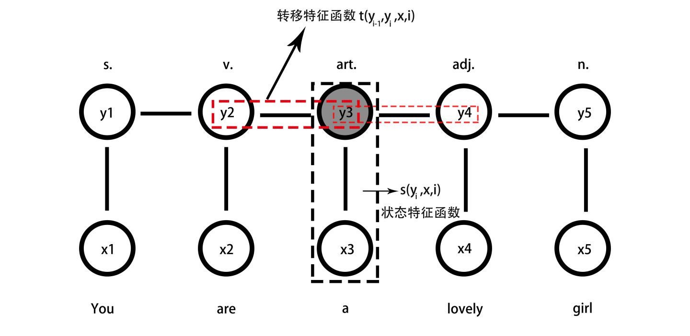

条件随机场是给定一组输入随机变量条件下，另一组输出随机变量的条件概率分布模型，其特点是假设输出随机变量构成马尔可夫随机场。

# 概率无向图模型

概率无向图模型（probabilistic undirected graphical model），又称为马尔可夫随机场（Markov random field），是一个可以由无向图表示的联合概率分布。

## 概念引入

- 概率图模型 概率图模型是由图表示的概率分布。无向图$G=(V,E)$表示概率分布$P(Y)$，节点$v \in V$表示一个随机变量$Y_v$；边$e \in E$表示随机变量之间的概率依存关系。

- 成对马尔科夫性 u和v是G中任意两个没有边连接的节点，其他所有节点为O。成对马尔科夫性是指给定随机变量组Y_o的条件下随机变量Y_u和Y_v是条件独立的，即

$$
P(Y_u,Y_v|Y_o)=P(Y_u|Y_o)P(Y_v|Y_o)
$$

- 局部马尔科夫性 v是G中任意一点，W是与v有边连接的所有节点，O是v,W以外的其他所有节点。局部马尔科夫性是指给定$Y_w$的条件下$Y_v$与$Y_o$是独立的，即

$$
P(Y_v,Y_o|Y_W)=P(Y_v|Y_W)P(Y_o|Y_W)
$$

- 全局马尔科夫性 A,B是G中被C分开的任意节点集合。全局马尔科夫性是指给定$Y_C$条件下$Y_A$和$Y_B$是条件独立的，即

$$
P(Y_A,Y_B|Y_C)=P(Y_A|Y_C)P(Y_B|Y_C)
$$

- 概率无向图模型 如果联合概率P(Y)满足成对、局部或者全局马尔科夫性，就称该联合概率分布为无向图模型，或者马尔科夫随机场。**最大特点：易于因子分解**。
- 团与最大团 无向图G中任何两个节点都有边连接的节点子集称为团（clique）。若不能再加进一个节点使团更大，称该团为最大团。
- 无向图模型的因子分解（factorization） $C$为$G$上最大团，$P(Y)$可以写作图中所有最大团C上的函数$Ψ_C(Y_C)$的乘积形式，即：

$$
P(Y)=\frac{1}{Z}\prod_C\Psi_C(Y_c)
$$

其中，Z是归一化因子：
$$
Z=\sum_Y\prod_C\Psi_C(Y_C)
$$

# 条件随机场的定义与形式

条件随机场是给定随机变量X条件下，随机变量Y的马尔可夫随机场。这里主要介绍定义在线性链上的特殊的条件随机场称为线性链条件随机场。

简单而又直白的讲，线性条件随机场，是只考虑 概率图中相邻变量是否满足特征函数$F(y,x)$的一个模型。

$$
P(Y_i|X,Y_1,...,Y_{i-1},Y_{i+1},...Y_n)=P(Y_i|X,Y_{i-1},Y_{i+1}) i = 1,2,...,n
$$

### 条件随机场的参数化形式

$$
P(y|x)=\frac{1}{Z(x)}exp(\sum_{i,k}\lambda_kt_k(y_{i-1},y_i,x,i)+\sum_{i,j}\mu_is_i(y_i,x,i))
$$

其中：
$$
Z(x)=\sum_yexp(\sum_{i,k}\lambda_kt_k(y_{i-1},y_i,x,i)+\sum_{i,j}\mu_is_i(y_i,x,i))
$$

## 条件随机场的简化形式

转移特征有$K_1$个，状态特征有$K_2$个：
$$
\begin{equation}
f_k(y_{i-1},y_i,x,i) = \begin{cases}
t_k(y_{i-1},y_i,x,i) ,k=1,2,...,K_1\\
s_i(y_i,x,i), k=K_1+l;l=1,2,...,K_2
\end{cases}
\end{equation}
$$
然后对各个位置$i$求和：
$$
f_k(y,x)=\sum_{i=1}^a nf_k(y_{i-1},y_i,x,i),k=1,2,...,K
$$
用$w_k$表示权重：
$$
\begin{equation}
w_k = \begin{cases}
\lambda_k,k=1,2,...,K_1 \\
\mu_l, k=K_l+1;l=1,2,..K_2
\end{cases}
\end{equation}
$$
于是条件随机场可表示为：
$$
P(y|x)=
$$

