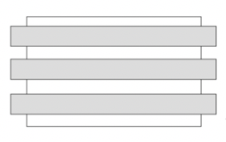
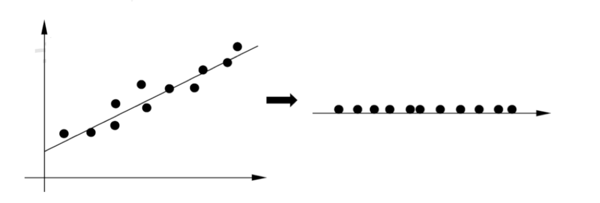

# 基本原理

- 无监督学习是从无标注的数据中学习数据的统计规律或者说内在结构的机器学习，主要包括**聚类、降维、概率估计**
- 无监督学习的基本想法是对给定数据（矩阵数据）进行某种“压缩”，从而找到数据的潜在结构。**假定损失最小的压缩得到的结果就是最本质的结构**

发掘数据的*纵向结构*，把相似的样本聚到同类，即对数据进行**聚类**


发掘数据的*横向结构*，把高维空间的向量转换为低维空间的向量，即对数据进行**降维**聚类



同时发掘数据的纵向和横向结构，假设数据由含有隐式结构的概率模型生成得到，从数据中**学习该概率模型**


# 三个基本问题

## 聚类

- 聚类（clustering）是将样本集合中相似的样本（实例）分配到相同的类，不相似的样本分配到不同的类。
- 聚类时，样本通常是欧氏空间中的向量，类别不是预先给定，而是从数据中自动发现，但类别的个数通常是预先给定的。样本之间的相似度或距离由 应用决定。


如果一个样本只能属于一个类，则称为硬聚类（硬聚类）
$$
z_i = g_\theta(x_i), i = 1,2,...,N
$$
如果一个样本可以属于多个类，则称为软聚类（软聚类）
$$
P_\theta(z_i|x_i), i = 1,2,...,N
$$

## 降维

- 降维（dimensionality reduction）是将训练数据中的样本（实例）从高维空间转换到低维空间
- 假设样本原本存在于低维空间，或者近似地存在于低维空间，通过降维则可以更好地表示样本数据的结构，即更好地表示样本之间的关系
- 高维空间通常是高维的欧氏空间，而低维空间是低维的欧氏空间或者流形（manifold)
- 从高维到低维的降维中，要保证样本中的信息损失最小



降维的模型是函数

```
z_i = g_\theta(x_i), i = 1,2,...,N
```

其中$x_i\in $是样本的高维向量，𝑧𝑖∈𝑍zi∈Z是样本的低维向量，𝜃θ是参数，函数可以是线性函数也可以是非线性函数，降维的过程就是学习降维模型的过程


