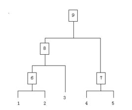

# 聚类的基本概念

**聚类的核心是相似度或距离。** 

## 相似度或距离

聚类的对象是观测数据或样本集合。假设有n个样本，每个样本有m个属性的特征向量组成。样本集合表示为:
$$
X = [x_{ij}]_{m \times n}=\left[
 \begin{matrix}
   x_{11} & x_{12} & ...  &x_{1n}\\
   x_{21} & x_{22} & ... & x_{2n} \\
   ... & ... & ...&...\\
   x_{m1} &x_{m2}&...&x_{mn}
  \end{matrix}
  \right] 
$$

### 闵可夫斯基距离

在聚类中，可以将样本集合想象成向量空间中的点，可以以空间的距离表示样本之间的相似度：
$$
d_{ij}=(\sum_{k=1}^m|x_{ki}-x_{kj}|^p)^{\frac{1}{P}}
$$
当$p=2$的时候为欧式距离

当$p=1$的时候为曼哈顿距离

当$p=∞$时称为切比雪夫距离，取各个坐标差点最大值
$$
d_{ij}=\max_k|x_{ki}-x_{kj}|
$$

### 马哈拉诺比斯距离

马哈拉诺比斯距离，简称马氏距离，是另一种常用的相似度。考虑各个分量(特征)之间的相关性并与各个分量的尺度无关。马哈拉诺比斯距离越大相似度越小，距离越小相似度越大。
$$
d_{ij}=[(x_i-x_j)^TS^{-1}(x_i-x_j)]^{\frac{1}{2}}
$$

### 相关系数

样本$x_i$与样本$x_j$之间的相关系数定义为：
$$
r_{ij}=\frac{\sum_{k=1}^M(x_{ki}-\overline{x_i})(x_{kj}-\overline{x_j})}{[\sum_{k=1}^M(x_{ki}-\overline{x_i})^2\sum_{k=1}^M(x_{kj}-\overline{x_j})^2]^\frac{1}{2}}
$$

其中：
$$
\overline{x_i}=\frac{1}{m}\sum_{k=1}^mx_{ki} \\
\overline{x_j}=\frac{1}{m}\sum_{k=1}^mx_{kj} \\
$$

### 夹角余弦

$$
s_{ij}=\frac{\sum_{k=1}^mx_{ki}x_{kj}}{[\sum_{k=1}^mx_{ki}^2x_{kj}^2]^{\frac{1}{2}}}
$$

## 类或簇

通过聚类得到的类或簇，本质是样本的子集。如果一个聚类方法假定一个样本只能属于一个类，或类的交集为空集，那么该方法称为硬聚类方法。否则，如果一个样本可以属于多个类，或类的交集不为空集，那么该方法称为软聚类方法。

用$G$表示类或簇，用$x_i,x_j$表示类中的样本，用$n_G$表示$G$中样本的个数，用$d_{ij}$表示样本$x_i$和$x_j$之间的距离

设$T$为给定的正数，若集合$G$中任意两个样本$x_i$，$x_j$
$$
d_{ij}\leq T
$$
设$T$为给定的正数，若集合$G$的任意样本$x_i$ ，一定存在$G$中的另一个样本$x_j$：
$$
d_{ij}\leq T
$$
设$T$为给定的正数，若集合$G$的任意样本$x_i$，$G$中的另一个样本$x_j$
$$
\frac{1}{n_G-1}\sum_{x_j \in G}d_{ij} \leq T
$$
设$T$和$V$为给定的两个正数，如果集合$G$中的任意两个样本$x_i$,$x_j$的距离定义：
$$
\frac{1}{n_G(n_G-1)}\sum_{x_i \in G}\sum_{x_j \in G} d_{ij} \leq T
$$
类的特征可以通过不同角度来刻画，常用的特征有下面三种：

- 类的均值$\overline{x}G$，又称类的中心

$$
\overline{x}G = \frac{1}{n_G}\sum_{i=1}^{n_G}x_i
$$

- 类的直径$D_G$

$$
D_G = \max_{x_i,x_j\in G}d_{ij}
$$

- 类的样本散布矩阵$A_G$和样本协方差矩阵$S_G$

$$
A_G=\sum_{i=1}^{n_G}(x_i-\overline{x_i}G)(x_i-\overline{x_i}G)^T \\
S_G= \frac{1}{m-1}A_G
$$

## 类类距离

1. 最短距离或单连接
2. 最长距离或完全连接
3. 中心距离
4. 平均距离

# 层次聚类

层次聚类( `Hierarchical Clustering` )是聚类算法的一种，通过计算不同类别的相似度类创建一个有层次的嵌套的树。

假设有 n 个待聚类的样本，对于层次聚类算法，它的步骤是：

- 步骤一：（初始化）将每个样本都视为一个聚类；
- 步骤二：计算各个聚类之间的相似度；
- 步骤三：寻找最近的两个聚类，将他们归为一类；
- 步骤四：重复步骤二，步骤三；直到所有样本归为一类。

# k均值聚类

K-Means 聚类算法的大致意思就是“物以类聚，人以群分”：

1. 首先输入 k 的值，即我们指定希望通过聚类得到 k 个分组；
2. 从数据集中随机选取 k 个数据点作为初始大佬（质心）；
3. 对集合中每一个小弟，计算与每一个大佬的距离，离哪个大佬距离近，就跟定哪个大佬。
4. 这时每一个大佬手下都聚集了一票小弟，这时候召开选举大会，每一群选出新的大佬（即通过算法选出新的质心）。
5. 如果新大佬和老大佬之间的距离小于某一个设置的阈值（表示重新计算的质心的位置变化不大，趋于稳定，或者说收敛），可以认为我们进行的聚类已经达到期望的结果，算法终止。
6. 如果新大佬和老大佬距离变化很大，需要迭代3~5步骤。

