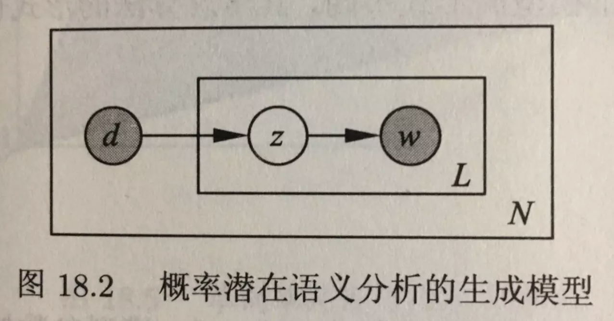

概率潜在语义分析（Probabilistic Latent Semantic Analysis，PLSA）是一种利用概率生成模型对文本集合进行话题分析的无监督学习方法。**模型最大特点是用隐变量表示话题。整个模型表示文本生成话题，话题生成单词。假设每个文本由一个话题分布决定，每个话题由一个单词分布决定。**

# 生成模型

生成模型中，单词变量与文本变量是观测变量，话题变量是隐变量。也就是说模型生成的是单词-话题-文本三元组)三元组的集合，但观测到的是单词-文本二元组)的集合。观测数据表示为单词-文本矩阵的形式，的行表示单词，列表示文本，元素表示单词-文本对)出现的次数。

