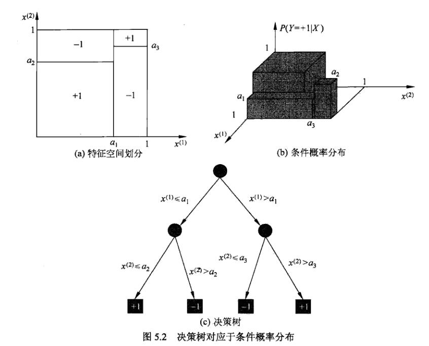

# 决策树模型与学习

决策树学习通常包括3个步骤：特征选择，决策树生成，剪枝。

决策树的内部结点表示一个特征或属性，叶结点表示一个类。

## 决策树模型

分类决策树模型是一种描述对实例进行分类的树形结构。决策树由结点和有向边组成。结点分为内部结点和叶结点。

## 决策树与if-then规则

**If-then**：决策树路径或其对应的if-then规则集合具有一个重要的性质，互斥并且完备，也就是说，每一个实例都被一条路径或一条规则所覆盖，而且只被一条路径或者一条规则覆盖。

## 决策树与条件概率分布

**概率分布**：决策树将特征空间划分为互不相交的单元，并在每个单元定义一个类的概率分布。决策树的一条路径对应于划分中的一个单元，决策树所表示的条件概率分布由各个单元给定条件下类的条件概率分布组成，即$𝑃(𝑌|𝑋)$，叶结点（单元）上的条件概率往往偏向某一类。

## 决策树学习

假设给定训练数据集：
$$
D = {(x_1,y_1),(x_2,y_2),...(x_N,y_N)}
$$
其中，$x_j=(x_j^{(1)},(x_j^{(2)},...,(x_j^{(n)})^T$为输入实例，$n$为特征个数，$y_i \in{1,2,...,K}$为类标记

# 特征选择

## 特征选择问题

## 特征选择问题

