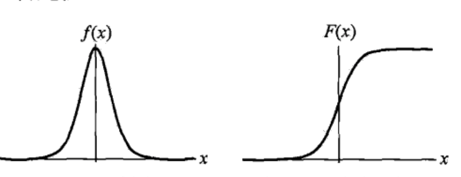

# 逻辑斯谛回归模型

## 逻辑斯谛分布

逻辑斯谛分布：设$X$是连续随机变量，$X$服从逻辑斯谛分布是指$X$具有下列分布函数和密度函数：
$$
F(x)=P(X \le x)=\frac{1}{1+e^{-(x-\mu)/\gamma}}； \mu为位置参数，\gamma>0为形状参数
$$

$$
f(x)=F^`(x)= \frac{e^{-(x-\mu)/\gamma}}{\gamma(1+e^{(x-\mu)/\gamma})^2}
$$

同时该曲线以点$(\mu,\frac{1}{2})$为中心对称：
$$
F(-x+\mu)-\frac{1}{2}=-F(x-\mu)+\frac{1}{2}
$$

## 二项逻辑斯谛回归模型

$$
P(Y=1|x)=\frac{exp(w \cdot x +b)}{1+exp(w \cdot x +b)}
$$

$$
P(Y=1|x)=\frac{1}{1+exp(w \cdot x +b)}
$$
有时可以把$w=(w^{(1)},w^{(2)},...,w^{n},b)^T$，以及x=(x^{(1)},x^{(2)},...,x^{(n)},1)，可以得到新的逻辑斯谛回归模型。

如果事件发生的概率是$p$，那么该事件的几率是$\frac{p}{1-p}$，该事件的对数几率（log odds）或logit函数是：
$$
logit(p)=log\frac{p}{1-p}
$$

更新公式：
$$
log\frac{P(Y=1|x)}{1-P(Y=1|x)} = w \cdot x
$$
继续得到新的公式：
$$
P(Y=1|x)=\frac{exp(w \cdot x)}{1 + exp(w\cdot x)}
$$
这时，线性函数的值越接近正无穷，概率值就越接近1；线性函数的值越接近负无穷，概率值就越接近0.这样的模型就是逻辑斯谛回归模型。

## 模型参数估计

$T=\{(x_1,y_1),(x_2,y_2),...,(x_N,y_N)\} ;x_i\in R^n;y_i \in \{0,1\}$，可以应用极大似然估计法估计模型参数。

Assume：
$$
P(Y=1|x)=\pi(x)
$$

$$
P(Y=0|x)=1-\pi(x)
$$
似然函数为：
$$
\prod_{i=1}^N[\pi(x_i)]^{y_i}[1-\pi(x_i)]^{1-y_i}
$$
对数似然函数为：
$$
L(w)=\sum_{i=1}^N[y_i(w \cdot x_i)]-log(1+exp(w\cdot x_i))
$$
对$L(w)$求极大值，得到w的估计值,便可以得到对应的逻辑斯谛回归模型。

## 多项逻辑斯谛回归

$Y =\{1,2,...,K\}$,得到多项逻辑斯谛回归模型：
$$
P(Y=k|x)=\frac{exp(w_k \cdot x)}{1 +\sum_{k=1}^{K-1}exp(w_k \cdot x)};k=1,2,...K-1
$$

$$
P(Y=K|x)=\frac{1}{1 +\sum_{k=1}^{K-1}exp(w_k \cdot x)}
$$

# 最大熵模型

最大熵原理认为，学习概率模型的时候，在所有可能的概率模型分布中，熵最大的模型是最好的模型。模型通常要满足数据集的约束条件。所以最大熵模型的原理可以被描述为在满足约束条件下熵最大的模型。

假设离散随机变量$X$的概率分布是p(X)，则其熵是：
$$
H(P)=-\sum_xP(x)logP(x)
$$
熵满足以下不等式：
$$
0 \leq H(P) \leq log|X|;|X|是X的取值个数
$$
直观地讲，最大熵原理，认为要选择的概率模型首先要满足已有的事实，即约束条件。然后再不确定信息的情况下，那些不确定的部分都是等可能的。最大熵原理通过熵的最大化来表示可能性，“等可能”不容易操作，但熵则是一个可以优化的数值指标。

